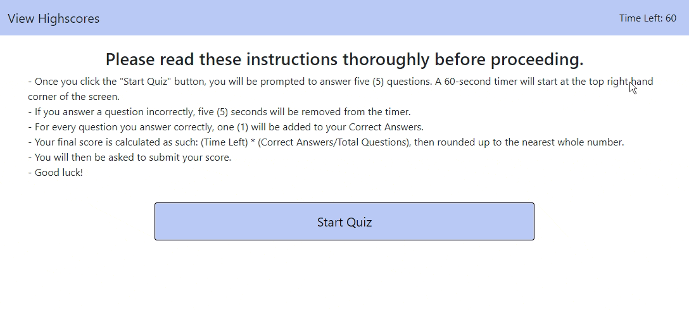

# JavaScript Code Quiz

This quiz will assess your basic JavaScript skills.  

Want to test your knowledge more than once?  No worries.  You can take the quiz and store your scores as many times as you would like.  

Please read the below for all pertinent information regarding this application.

## Table of Contents

[Quiz Functionality](#quiz-functionality)\
[Scoring](#scoring)\
[Visual Representation](#visual-representation)\
[Code Used and Credits](#code-used-and-credits)\
[Project Takeaways](#project-takeaways)

## Quiz Functionality

This is a basic, 5-question multiple choice quiz about basic rules regarding Javascript.  There are instructions on the homepage for the user to follow.  Once the "Start Quiz" button is clicked, a 60-second timer will start and then you will be prompted through each question.  After a selection is made, the next question will load on the page.  This process will repeat until you are done with the quiz.  

If the timer runs out, you will have to start over.  For a breakdown of the scoring process, continue reading below.

## Scoring

The scoring is two-fold:
- Time
- Correct Answers

As mentioned above, there is a 60-second timer running while the quiz is in process.  At the same time, the application will be keeping count of the number of questions you answer correctly.  Your final score is a combination of both factors calculated as such:

- **(Time Remaining) * (Correct Answers/Total Number of Questions)**

Once you receive your score at the end of the quiz, you will be prompted to submit the score to the Highscore page.  You can visit this page at any time by clicking the "View Highscores" tab at the top left corner of the screen. 

On the "Highscores" page, you will be able to view any submitted scores.  You can clear this list at any time and return back to the quiz by clicking the "Back to Quiz" tab.

## Visual Representation

The following animation demonstrates the application functionality:

## Code Used and Credits

- JavaScript
- HTML/CSS
- [Bootstrap](https://getbootstrap.com/)

## Project Takeaways

As expected, this was the most challenging project to date.  Having to start from scratch, I had to knock the rust off my HTML/CSS skills.  I was able to get reacquainted with Bootstrap, so that was nice.  For me, the main three takeaways from this project were:
- Writing/Calling Functions from Scratch
- DOM Manipulation Using Event Handlers (primarily used "click")
- Local Storage functionality (storing and rendering items from local storage)
I look forward to the next challenge!
